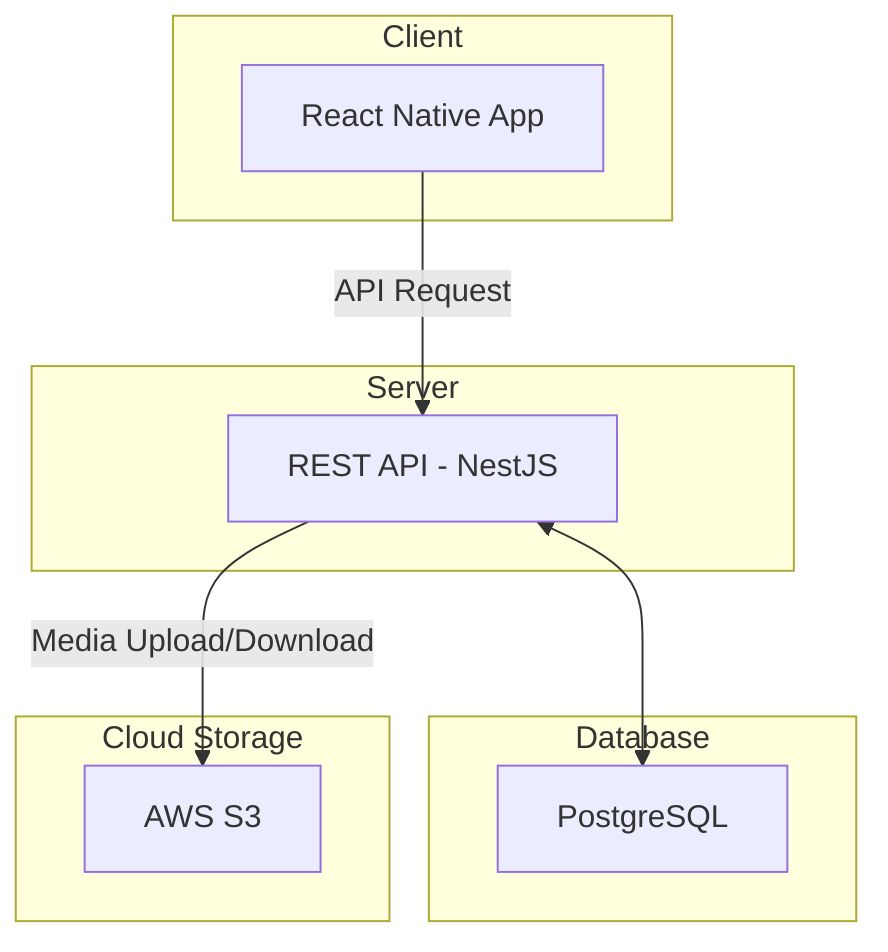

# 🎵 Recho (레코) - 음악인을 위한 올인원 소셜 플랫폼

**Recho는 흩어져 있는 음악인들을 하나로 모으고, 그들의 열정을 공유하며 함께 성장할 수 있도록 돕는 올인원 모바일 커뮤니티 플랫폼입니다.**

단순한 정보 공유를 넘어, 악기 거래, 합주 멤버 모집, 그리고 숏폼 영상을 통한 교류까지, 음악 활동에 필요한 모든 것을 Recho에서 해결하세요.

 

> ## 📸 스크린샷 (Screenshot)
>
> *(이곳에 앱의 주요 화면 스크린샷이나 GIF를 추가하여 프로젝트를 시각적으로 보여주세요.)*
>
> | 커뮤니티 | 악기 거래 | 합주자 모집 | 바이닐 (숏폼) |
> | :---: | :---: | :---: | :---: |
> |  |  |  |  |

 

## ✨ 주요 기능 (Features)

Recho는 다음과 같은 핵심 기능들을 제공합니다.

* **🎸 음악 커뮤니티**
    * 자유 게시판: 음악에 대한 잡담, 질문, 팁 등 자유롭게 소통하는 공간
    * 정보 공유: 좋은 음악, 연주 영상, 유용한 사이트 등 정보를 나누는 공간
    * 게시물/댓글 추천 및 스크랩 기능

* **🎻 중고 악기 마켓플레이스**
    * 안전하고 편리한 사용자 간 악기 거래 기능
    * 악기 카테고리별(기타, 베이스, 건반, 드럼 등) 필터링
    * 채팅을 통한 가격 및 거래 방식 조율

* **🎤 합주/밴드 멤버 모집**
    * 지역, 선호 장르, 모집 파트(보컬, 기타 등)에 기반한 맞춤형 검색
    * 프로필을 통해 상대방의 연주 스타일과 경력 확인
    * 프로젝트 밴드부터 정규 밴드까지 다양한 형태의 멤버 모집

* **📼 바이닐 (음악 숏폼)**
    * 자신의 연주 영상을 1분 이내로 공유하는 숏폼 피드
    * '이 주의 챌린지' 등 다양한 주제의 연주 챌린지 참여
    * '좋아요'와 댓글을 통한 사용자 간의 음악적 교류

 

## 🚀 프로젝트 목표 및 기획 의도

* **파편화된 정보 통합**: 여기저기 흩어져 있는 합주 멤버 구인, 악기 거래, 커뮤니티 정보를 한곳에 모아 정보 탐색 비용을 줄입니다.
* **음악적 교류의 장**: 온라인에서 쉽게 만나기 어려운 다른 연주자들과 교류하고, 음악적 영감을 주고받을 수 있는 소셜 허브를 제공합니다.
* **안전한 거래 환경**: 신뢰 기반의 악기 거래 시스템을 구축하여 아마추어 및 프로 뮤지션들이 안심하고 악기를 거래할 수 있도록 지원합니다.
* **자기 PR 기회 제공**: '바이닐' 숏폼 기능을 통해 자신의 연주를 쉽게 알리고 잠재적인 밴드 멤버나 팬들에게 자신을 어필할 기회를 만듭니다.

 

## 🛠️ 기술 스택 (Tech Stack)

| 구분 | 기술 |
| :--- | :--- |
| **Frontend** | `React Native`, `React`, `TypeScript`, `Redux Toolkit`, `Styled-Components` |
| **Backend** | `Node.js`, `NestJS`, `TypeScript`, `Passport (JWT)` |
| **Database** | `PostgreSQL` |
| **Deployment** | `AWS S3`, `AWS EC2`, `AWS RDS`, `Docker` |

 

## 🏗️ 시스템 아키텍처 (Architecture)

## 🤝 팀원 (Contributors)

| 이름 | 역할 | GitHub |
| :---: | :---: | :---: |
| 이시우 | **Full-Stack / Team Lead** | **[GitHub Profile](https://github.com/dltldn333)** |
| 김경연 | Frontend | [GitHub Profile](https://github.com/teammate2) |
| 노기윤 | Backend | [GitHub Profile](https://github.com/teammate3) |
| 신동주 | Backend | [GitHub Profile](https://github.com/teammate3) |
| 장예지 | Backend | [GitHub Profile](https://github.com/teammate3) |

## 📜 라이선스 (License)

This project is licensed under the **MIT License**.
